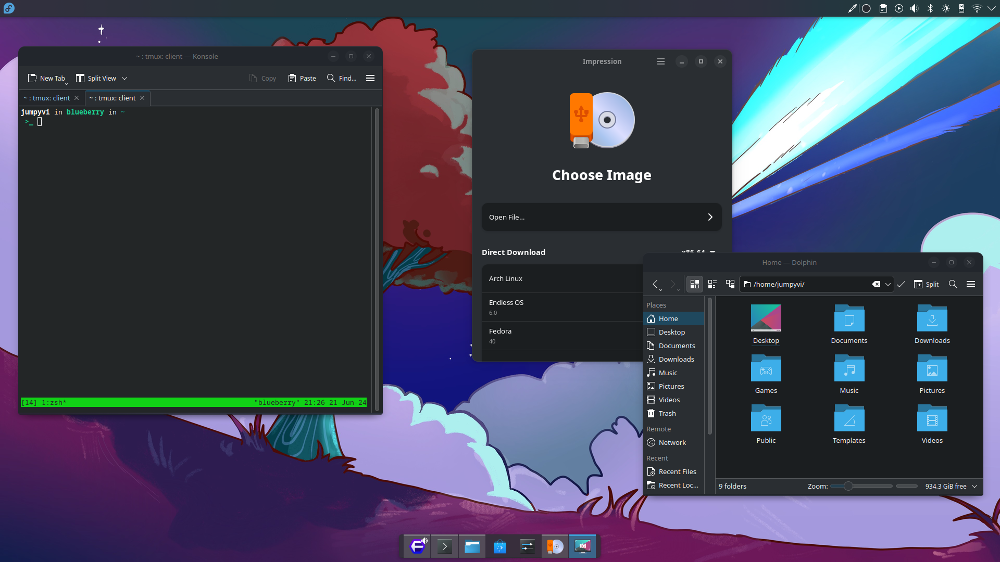

## adw-breezebar

Window decorations the for KDE Plasma to make QT apps look like adwaita apps, allowing KDE to look good with adwaita apps.
This uses breeze colors and not adwaita ones. A breeze theme for GTK is recommended.

This is forked from https://github.com/vinceliuice/Lavanda-kde, vinceliuice did most of the work with the Lavanda theme, I simply changed a few colors and removed the global theme (kept only the decoration theme) to make kde app look like they use adwaita.

## Installation

```sh
./install.sh
```

## Uninstall

```sh
rm -r ~/.local/share/aurora/themes/adw-breezebar-*
```

## Recommendations

- Use adwaita title bar in native adwaita apps instead of KDE one: ```bash gsettings set org.gnome.desktop.interface icon-theme Adwaita ```
  - This dosen't seem to work well on the latest Plasma, you can also use a global icon theme that dosen't theme adwaita titlebar (ex: [colloid icon theme](https://github.com/vinceliuice/Colloid-icon-theme))
- Use the Breeze gradience theme: https://gradienceteam.github.io/

## License

GNU GPL v3

## Screenshot
This is a screenshot from an older release, the new version looks better.




